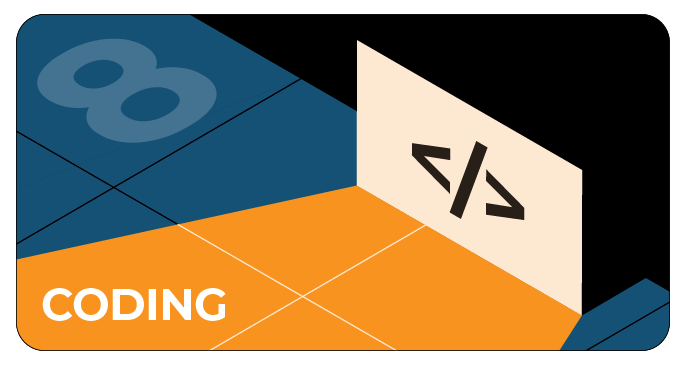

# Задачи на фестивальчик TechTrain 2020

На GitHub мы проведем конкурс для тех, кто хочет покодить. На нашей странице вы найдете восемь задач по количеству направлений в наших конференциях. После решения задачи нужно засабмитить ее в Pull Requests.

Решать задачки можно будет и после фестиваля: мы будем принимать ответы до 18.00 воскресенья (7 июня). Всего призеров будет восемь — по одному в каждом направлении. Победителей мы объявим в рассылке с материалами TechTrain 2020. Каждый из них получит промокод на бесплатный Full Pass.

# Время решать задачи

[Ссылка на репозиторий с задачами](https://github.com/JUGRuGroupOnline/TechTrain2020)

# А пока фулл пасс можно выиграть, поучаствовав в конкурсе Most popular post

В конкурсе на лучший пост от зрителей фестиваля можно поучаствовать в инстаграме и в твиттере. Для этого нужно сделать фотографию с айдентикой TechTrain или написать отзыв о фестивале.

В инстаграме [jugrugroup](https://www.instagram.com/jugrugroup/) нужно сделать композиционное фото, на котором виден экран монитора или гаджета с трансляцией фестиваля TechTrain 2020. Например, вы можете сфотографировать своего кота, который лежит на клавиатуре и внимательно слушает доклад. Фотографию нужно выложить в инстаграм, поставив хэштег #янатехтрейн и тегнув профиль JUG Ru Group (@jugrugroup).

В твиттере [techtrainfest](https://twitter.com/techtrainfest) нужно уложить свой отзыв об участии в фестивале в 270 символов. Это может быть что угодно — рифма, шутка, хокку. Не забудьте отметить аккаунт @jugrugroup и поставить хэштег #янатехтрейн. Один участник может написать сколько угодно твитов.
Модераторы принимают к конкурсу все посты, опубликованные с 12:30 до 15:30 (МСК). Ближе к концу TechTrain мы определим двух победителей (в инстаграме и в твиттере). Имена призеров объявим на закрытии и вышлем им промокоды на бесплатный Full Pass билет.

